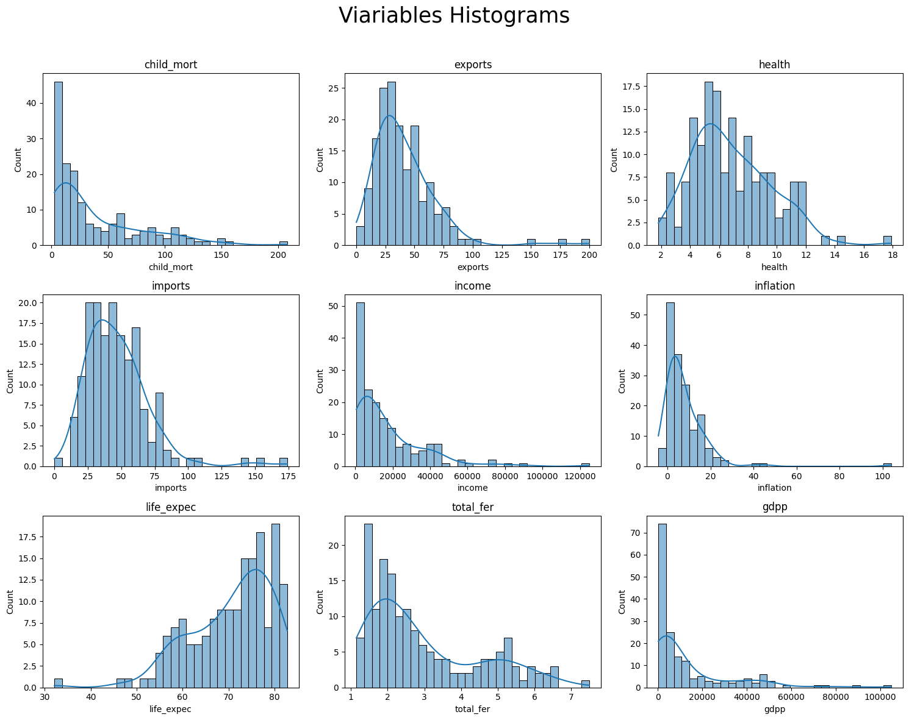
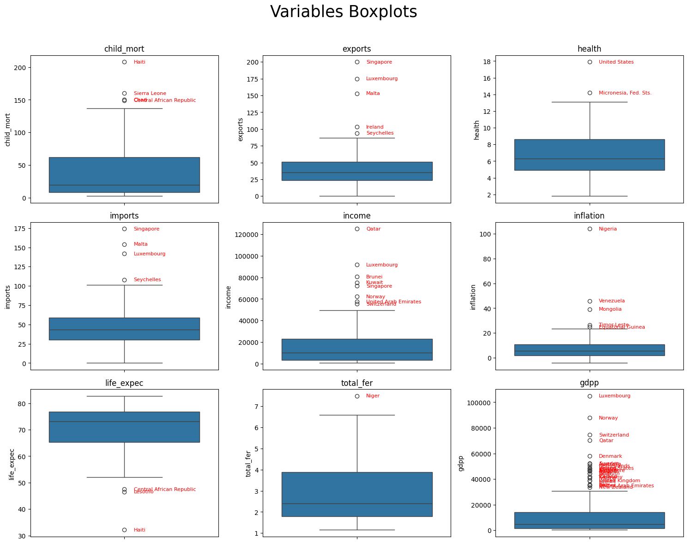
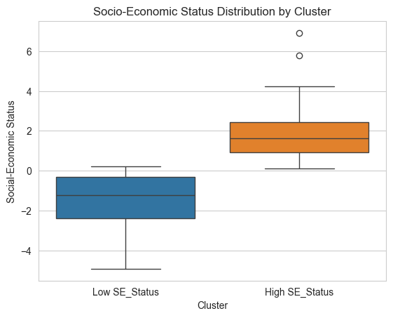

# 📊 Clustering & PCA - Analysis of Developing Countries

## 📝 Objective

The International Humanitarian NGO has recently raised approximately **10 million dollars**.  
The CEO of the organization must decide **how to allocate these funds strategically and effectively**.

Our task, as **Data Analysts**, is to:

- Classify countries based on **socio-economic and health-related factors**.
- Identify countries most in need of aid.
- Provide a prioritized list to focus humanitarian investments.

---

## 📂 Dataset Structure

The dataset includes **167 countries** and the following variables:

| **Column**   | **Description**                               |
| ------------ | --------------------------------------------- |
| `country`    | Name of the country                           |
| `child_mort` | Under-5 child mortality per 1,000 live births |
| `exports`    | Exports of goods and services (as % of GDP)   |
| `health`     | Total health expenditure (as % of GDP)        |
| `imports`    | Imports of goods and services (as % of GDP)   |
| `income`     | Net income per capita                         |
| `inflation`  | Annual GDP growth rate                        |
| `life_expec` | Life expectancy at birth                      |
| `total_fer`  | Average number of children per woman          |
| `gdpp`       | GDP per capita (Total GDP / population)       |

Example of data:

| **Country**         | **Child Mort** | **Exports** | **Health** | **Imports** | **Income** | **Inflation** | **Life Expec** | **Total Fer** | **GDP per capita** |
| ------------------- | -------------- | ----------- | ---------- | ----------- | ---------- | ------------- | -------------- | ------------- | ------------------ |
| Afghanistan         | 90.2           | 10.0        | 7.58       | 44.9        | 1610       | 9.44          | 56.2           | 5.82          | 553                |
| Albania             | 16.6           | 28.0        | 6.55       | 48.6        | 9930       | 4.49          | 76.3           | 1.65          | 4090               |
| Algeria             | 27.3           | 38.4        | 4.17       | 31.4        | 12900      | 16.10         | 76.5           | 2.89          | 4460               |
| Angola              | 119.0          | 62.3        | 2.85       | 42.9        | 5900       | 22.40         | 60.1           | 6.16          | 3530               |
| Antigua and Barbuda | 10.3           | 45.5        | 6.03       | 58.9        | 19100      | 1.44          | 76.8           | 2.13          | 12200              |

---

## 📈 Preliminary Analysis

**Histograms** and **boxplots** were produced to analyze the variable distributions:

From the exploratory analysis, the following observations were made:

- Presence of **long tails** in the distributions, especially for:
  - `income`
  - `inflation`
  - `gdpp`
  - (to a lesser extent) `exports`
- These asymmetries are likely due to the inclusion of many countries that differ in population size and, above all, in economic development. For example, among the upper outliers in `income`, we find countries like Qatar, Luxembourg, and the USA—nations with high capital concentration. The same applies to `gdpp` and `import`.

---

## 🔍 Techniques Used

Two key techniques were applied:

- **PCA (Principal Component Analysis)**: to reduce dimensionality and synthesize the information.
- **Cluster Analysis**: to group countries according to a socio-economic development score.

The analysis results allowed the identification of **two main groups**:

- **High socio-economic development countries**
- **Low socio-economic development countries**

---

## 🌍 Ranking of the Most Needy Countries

From the obtained clusters, a **Top 10 list of countries with the lowest development scores** was derived. These countries should receive **priority for humanitarian aid**:

| **Rank** | **Country**              | **Score** |
| -------- | ------------------------ | --------- |
| 1st      | Nigeria                  | 3.336     |
| 2nd      | Haiti                    | 3.009     |
| 3rd      | Central African Republic | 2.719     |
| 4th      | Chad                     | 2.454     |
| 5th      | Niger                    | 2.384     |
| 6th      | Mali                     | 2.359     |
| 7th      | Sierra Leone             | 2.339     |
| 8th      | Congo, Dem. Rep.         | 2.204     |
| 9th      | Burkina Faso             | 2.170     |
| 10th     | Malawi                   | 2.078     |

---

## ✅ Conclusion

The analysis clearly shows that **Nigeria** is the country **most in need of humanitarian aid**.  
The top 10 countries represent the most vulnerable group globally and should be considered a **priority target** for the strategic use of the raised funds.
